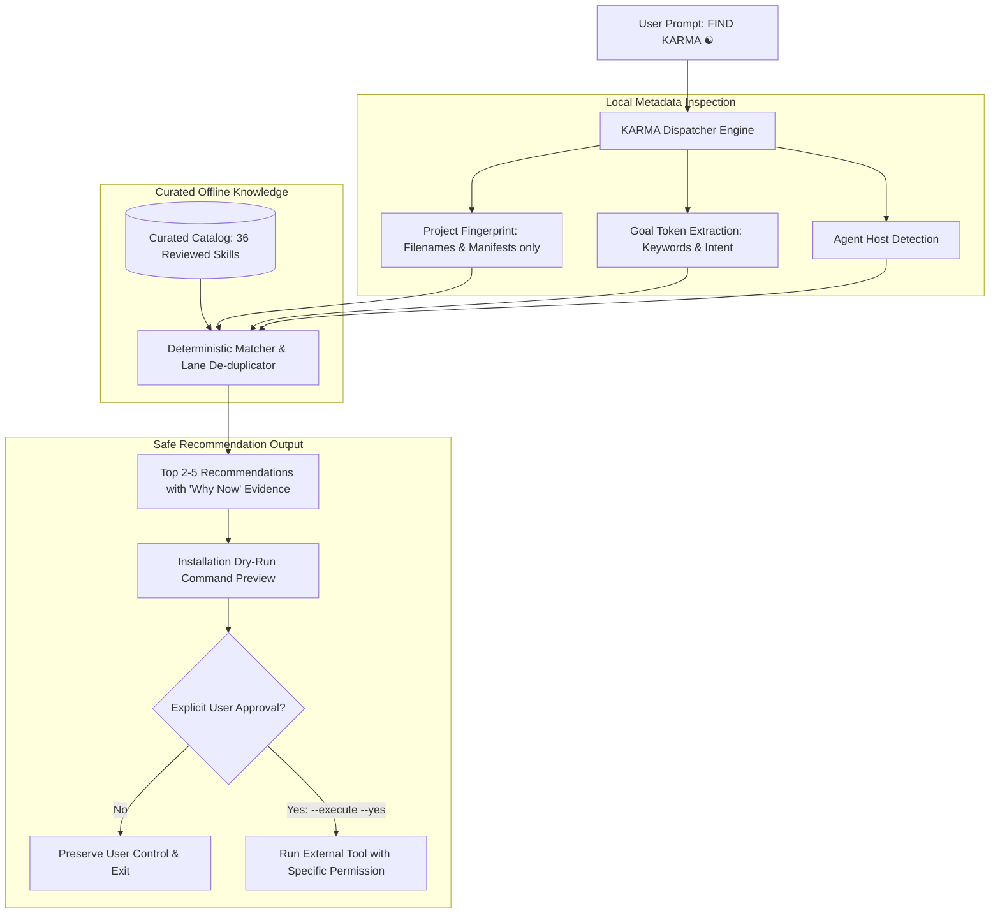

<div align="center">

# ☯ KARMA

### The Skill for Skills: Offline-First Contextual Discovery of Curated AI Agent Capabilities
**Fit Over Fame • Zero Telemetry • Human Approval First • Multi-Agent Ready**

[](LICENSE)
[](https://python.org)
[](https://bun.sh)
[](https://skills.sh)
[](https://claude.ai)
[](SKILL.md)

<p align="center">
  <a href="#-quickstart">Quickstart</a> •
  <a href="#-multi-agent-adapters">Multi-Agent Adapters</a> •
  <a href="#-architecture">Architecture</a> •
  <a href="#-curated-catalog--trust">Catalog & Trust</a> •
  <a href="#-security--safety-invariants">Security Policy</a> •
  <a href="#-development--testing">Development</a>
</p>

</div>

---

## ⚡ Overview

Give your coding agent the prompt:

```text
FIND KARMA ☯
```

And receive a **short, explainable, curated set of skills and plugins** tailored to your repository's tech stack and immediate goal.

KARMA is built with a strict **offline-first and user-sovereignty** philosophy:
- **No external model calls or API keys**: Runs using Python stdlib and fast Bun/Node wrappers.
- **No background telemetry or tracking**: Operates entirely within your local workspace.
- **No surprise installations**: `find` is strictly read-only; `install` is a dry-run preview by default.

---

## 🚀 Quickstart

### 1. Instant Zero-Install (Bun / npx)

```bash
# Doctor check
bunx find-karma doctor
# or
npx find-karma doctor

# Discover skills for your active project
bunx find-karma find --project . --goal "Fix React UI quality" --agent claude-code
```

### 2. Universal Multi-Agent One-Liner

Install KARMA into all detected coding agents on your machine in one command:

```bash
git clone https://github.com/imMamdouhaboammar/karma-skill.git
cd karma-skill
./install.sh
```

Or install directly into a specific project workspace:

```bash
./install.sh --project /path/to/your/project
```

### 3. Local Python Execution

```bash
./bin/karma doctor
./bin/karma find --project . --goal "Security audit and secrets" --agent codex
```

---

## 🔌 Multi-Agent Adapters

KARMA ships with first-class adapter manifests and profiles for the entire AI agent ecosystem:

| Agent Host | Integration Path | Manifest / Config | Discovery Mode |
|---|---|---|---|
| **Claude Code & Desktop** | `.claude/skills/find-karma` | `marketplace.json`, `.claude-plugin/` | Automatic on `FIND KARMA` |
| **OpenAI Codex & ChatGPT** | `.agents/skills/find-karma` | `.codex-plugin/plugin.json` | Automatic via plugin contract |
| **Cursor IDE** | `.cursor/skills/find-karma` | `.cursor/rules/find-karma.mdc` | MDC rule-triggered |
| **Google Antigravity** | `.agent/skills/find-karma` | `skills/find-karma/SKILL.md` | Skill-loop native |
| **Gemini CLI** | `.gemini/skills/find-karma` | `~/.gemini/config/skills/` | CLI skill load |
| **Windsurf** | `.windsurf/skills/find-karma` | `SKILL.md` & workspace rules | Cascading skill |
| **OpenCode** | `.opencode/skills/find-karma` | `skills/find-karma/` | Native skill registry |
| **Skills.sh (Vercel)** | Root registry | `.skills.json` | `npx skills add <repo>` |
| **npm / Bun CLI** | Global / Local binary | `package.json` (`bin/cli.js`) | `bunx find-karma` / `karma` |
| **Python Package** | Virtualenv / pip | `pyproject.toml` | `pip install .` (`karma`) |

---

## 🏗️ Architecture



---

## 🎯 Usage Examples

### 1. Recommending UI Skills for a React Repository

```bash
./bin/karma find --project ./examples/react-app --goal "frontend UI polish" --agent codex
```

```text
☯ KARMA Recommendations (agent: codex)
1. ui-skills (lane: frontend-quality)
   Why: Detected React 19 + TypeScript dependencies in package.json.
   Source: https://github.com/ibelick/ui-skills
   Installation: npx --yes skills add ibelick/ui-skills -a codex -y
```

### 2. JSON Mode for Orchestrators & Multi-Agent Swarms

```bash
./bin/karma find --project . --goal "TDD testing coverage" --agent claude-code --json
```

---

## 🛡️ Security & Safety Invariants

KARMA strictly adheres to the **Security Best Practices** guidelines:

1. **Read-Mostly Metadata Scan**:
   KARMA scans project manifests (e.g. `package.json`, `Cargo.toml`, `pyproject.toml`, `go.mod`) and filenames. It **never reads credentials, `.env` files, private keys, or source file internals**.

2. **No Unauthenticated Remote Execution**:
   No code is executed remotely. Running `find` never makes outbound HTTP calls or downloads packages.

3. **Dry-Run by Default**:
   `karma install` prints a dry-run preview command. It will refuse to invoke external commands unless both `--execute` and `--yes` are explicitly passed.

4. **Symlink Boundary Protection**:
   Directory symlinks outside the repository root are ignored during project inspection, and `init-agent` strictly refuses to write through symlinked agent target directories.

5. **Untrusted Data Isolation**:
   GitHub API responses during optional `sync-stars` are stored in `.karma/starred-candidates.json` for human inspection and are strictly forbidden from automatic catalog promotion or script execution.

---

## 📦 Curated Catalog & Trust

Sources include tested skills and tools from across the ecosystem:
- `mattpocock/skills` (TDD, Engineering workflow)
- `trailofbits/skills` (Security audits, Vulnerability verification)
- `K-Dense-AI/scientific-agent-skills` (Scientific research, Literature reproduction)
- `imMamdouhaboammar/dokion` (Supply chain security & provenance)
- `ai-evals-course/evals-skills` (Evaluation suites)
- `ibelick/ui-skills` (Modern visual UI & React craft)
- `cisco-ai-defense/skill-scanner` (Agent skill security scanning)

> **Note**: `reviewed` indicates catalog maintainers verified the structure, license, and repository metadata. It is not an endorsement of unverified third-party HEAD revisions.

---

## 🧪 Development & Testing

Ensure all tests pass before making contributions:

```bash
# Build portable artifacts
python3 scripts/build_skill.py

# Run Bun CLI tests
bun test

# Run Python unittest suite
PYTHONPATH=src python3 -m unittest discover -s tests -v

# Validate catalog constraints
PYTHONPATH=src python3 -m karma validate
```

---

## 📄 License

MIT © 2026 [Mamdouh Aboammar](https://github.com/imMamdouhaboammar)
